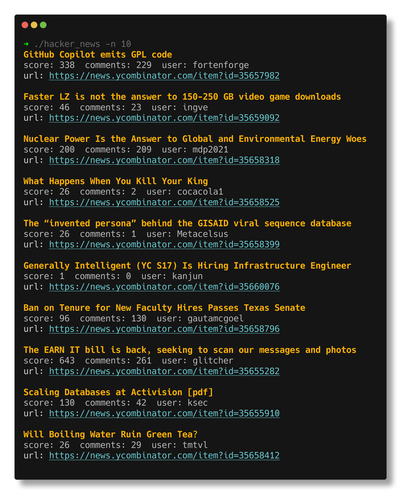

# hacker_news

A command line tool that shows the top stories from [Hacker News](https://news.ycombinator.com/) using the [Hacker News API from Firebase](https://github.com/HackerNews/API).

This is a port of an dotnet version, [hn-top](https://github.com/amscotti/hn-top) which I used to learn about Go and understand how to keep the order of the stories when using Goroutines.



## Building and Running

### With Go

To build and run the application, follow these steps:

1. Clone the repository.
2. Navigate to the root directory of the project.
3. Build the binary with `go build`.
4. Run the binary with `./hacker_news`.

### With Docker

To build and run the application with Docker, follow these steps:

1. Clone the repository.
2. Navigate to the root directory of the project.
3. Build the Docker image with `docker build -t hacker_news .`.
4. Run the Docker container with `docker run hacker_news`.

### With pre-built Docker image from [ghcr.io](https://github.com/amscotti/hacker_news/pkgs/container/hacker_news)

To download and run the pre-built Docker image, follow these steps:

1. Install Docker.
2. Run the command `docker run ghcr.io/amscotti/hacker_news:main`.

### Command Line Arguments

The following command line arguments are available:

```
Usage of ./hacker_news:
  -n int
        Specify the number of top stories to display. (default: 30)
  -u    Include the source URLs of the stories in the output.
```
